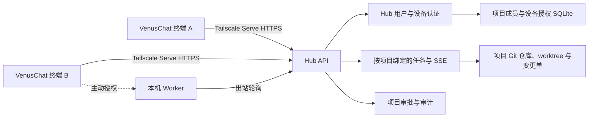
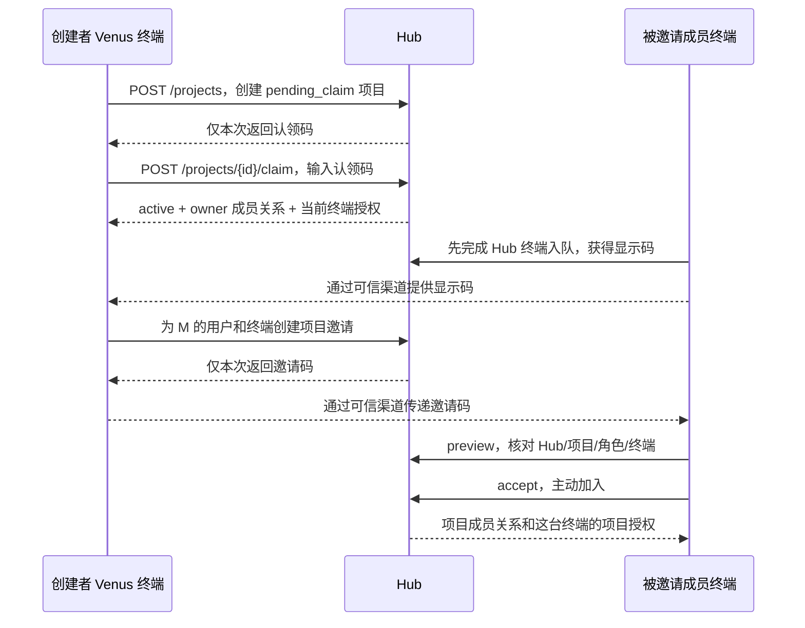

# Venus 多项目 Hub：实现架构与验收记录

本文记录当前仓库中的多项目 Hub 工程实现。产品目标和完整任务边界见 [实施任务提示词](venus-multi-project-hub-task-prompt.md)，Linux 部署和回退操作见 [部署指南](multi-project-hub-deployment.md)。本文中的测试结果只代表本地临时数据目录中的自动化验证；真实服务器和两台 Venus 终端的联调需另行执行并记录。

## 1. 系统组成



Hub 在服务器上以 `--isolated --team-serve` 模式运行，HTTP 仅监听 `127.0.0.1:8001`。Tailscale Serve 提供 tailnet 内 HTTPS 入口，Venus 仍逐请求验证 Hub 用户、设备凭证、项目成员身份、项目终端授权和对象所属项目。Hub 级管理员只负责服务器和 Hub 入队；项目 owner/admin/member/viewer 是项目内角色。加入项目本身不启动本机 Worker。

### 身份与四种代码

| 对象 | 作用 | 授权边界 |
| --- | --- | --- |
| Hub 设备凭证 | 证明当前已批准终端，客户端安全存储 | 每次 Hub 请求认证；撤销后失效 |
| 终端显示码 | 负责人定位指定终端 | 公开标识，不可用于登录 |
| 项目认领码 | 创建者认领新项目 owner | 只向创建者显示一次；绑定用户、终端、项目，过期及限次 |
| 项目邀请码 | 邀请绑定的用户与终端加入项目 | 一次性、限时、可撤销，服务端保存摘要 |

## 2. 创建、邀请与工作流程



每个团队任务必须带 `project_id`。Job、SSE、工作目录、变更单和审批均以项目为作用域；服务端查询对象后再检查请求设备的项目授权。审批基于准确提交 SHA 和项目合格审阅人集合，作者不能给自己的代码变更投票；成员离开或设备撤权时重新计算或使旧票失效。共享文件只有经明确 Git 变更单审阅后才能进入项目仓库。

## 3. 数据模型与状态

项目元数据、里程碑和现有任务仍沿用原存储；项目权限元数据放在 `project_access.db`，项目 Git 仓库和 worktree 继续按 `project_id` 分目录。权限数据库主要包含 `project_memberships`、`project_device_grants`、`project_claims`、`project_invites`、`project_policies`、`active_projects`、`project_owner_transfers`、迁移问题记录及 schema 元数据。Worker 调用和审批票单独放在 `worker_calls.db`。服务端仅保存一次性代码和 Worker 租约的摘要。

| 实体 | 关键状态与规则 |
| --- | --- |
| 项目 | `pending_claim → active`；未认领不能创建任务或查看资源。归档为 owner 专属单向操作；只读历史保留，归档状态不能重新激活 |
| 认领码 | `issued → claimed/expired/revoked`；创建者和终端同时匹配 |
| 邀请 | `issued → accepted/expired/revoked`；用户、终端、项目绑定 |
| 成员 | `active → removed`；移除不能移走唯一 owner |
| 项目终端授权 | `active → revoked`；撤销某项目终端不影响其他项目 |
| 所有权转移 | owner 发起，目标成员在自己的已授权终端接受 |
| 活跃项目 | 使用 `(user_id, device_id)` 保存；服务端再次校验访问权 |

SQLite 中的单库多行状态转换使用事务；项目 JSON、Git 仓库和 SQLite 之间的步骤需要幂等恢复或失败补偿。审计记录操作人、项目、对象和结果，不能记录认领码、邀请码或设备凭证原文。

## 4. 关键 API 合同

路径均以 `/api/v1` 为前缀。Team Serve 请求须携带与 Tailscale 登录身份绑定的 `X-Team-Device-Token`；创建项目、认领和接受邀请都不能仅凭终端显示码执行。

| 方法与路径 | 用途 | 权限 |
| --- | --- | --- |
| `GET /team/me` | 查看当前 Hub 用户、设备与显示码 | 已认证终端 |
| `GET /projects` | 列出可访问项目及本人待认领项目 | 已认证终端；逐项目过滤 |
| `POST /projects` | 创建 `pending_claim` 项目，返回一次性认领码 | 已认证终端 |
| `POST /projects/{id}/claim` | 输入认领码成为 owner | 绑定的创建者与终端 |
| `POST /projects/{id}/claim-code` | 重新签发未认领项目代码 | 绑定的创建者与终端 |
| `POST /projects/{id}/archive` | 将项目设为只读，撤销未完成 Worker 调用并清理未用邀请 | 当前项目 owner 的获准终端 |
| `POST /projects/{id}/invites` | 指定用户、终端显示码和角色，返回一次性邀请码 | 项目 owner/admin |
| `POST /project-invites/preview` | 核对邀请码对应的项目、角色和终端 | 邀请绑定的用户与终端 |
| `POST /project-invites/{id}/accept` | 接受邀请，创建成员与终端授权 | 邀请绑定的用户与终端 |
| `GET /projects/{id}/members` | 查看项目成员与获准终端 | 项目获准终端 |
| `DELETE /projects/{id}/members/{user_id}` | 移除普通成员并撤销其项目终端 | 项目 owner/admin |
| `POST /projects/{id}/devices/{device_id}/revoke` | 撤销指定终端的项目访问 | 项目 owner/admin；不得移除 owner 最后授权终端 |
| `GET /projects/{id}`、`GET /projects` | 返回已授权团队项目的 `required_approvals` 与 `policy_version` | 项目获准终端；待认领项目不返回策略 |
| `POST /projects/{id}/governance-proposals` | 创建 `promote_admin`、`lower_approval_threshold` 或 `owner_transfer` 提案；请求含 `action`、唯一 `request_id`、按动作提供 `target_user_id` 或 `required_approvals` | 当前 owner |
| `GET /projects/{id}/governance-proposals`、`GET /projects/{id}/governance-proposals/{proposal_id}` | 读取提案列表或详情 | 项目获准终端 |
| `POST /projects/{id}/governance-proposals/{proposal_id}/votes` | 对提案投 `approve` 或 `reject`；响应含 `{ok,proposal}` | 当前 active owner/admin/member；发起人不能投 |
| `PATCH /projects/{id}/members/{user_id}/role` | 降低非 owner 角色；admin 提权须创建治理提案 | 项目 owner |
| `PUT /projects/{id}/policy` | 提高代码变更审批票数与策略版本；降低票数须创建治理提案 | 项目 owner |
| `POST /projects/{id}/owner-transfer/accept` | 接受所有权 | 指定目标成员的已授权终端 |
| `GET /projects/{id}/audit` | 查看项目审计 | 项目获准终端 |
| `GET/POST /jobs`、`GET /jobs/{id}/events` | 派发、查看任务及实时事件 | 任务所属项目授权；写入需非 viewer |
| `GET /projects/{id}/changes/{change_id}/diff` | 查看准确变更差异 | 项目获准终端 |
| `POST /projects/{id}/changes/{change_id}/review` | 对准确 SHA 投票 | 合格的非作者项目成员 |
| `POST /worker/tasks` | 创建项目 Worker Job 和首个文件调用 | 非 viewer 项目成员；目标终端已加入项目 |
| `GET /worker/calls?project_id=...` | 查看项目 Worker 调用、参数和有效票数 | 项目获准终端 |
| `POST /worker/calls/{id}/votes` | 对准确参数摘要投批准或拒绝票 | 非发起人的合格成员 |
| `POST /worker/poll`、`POST /worker/calls/{id}/preflight`、`POST /worker/calls/{id}/complete` | 目标终端领取租约、执行前复核及回报结果 | 项目内指定终端 |

常见错误：`401` 代表 Hub 终端认证失败，`403` 代表用户或角色不匹配，`404` 对无权项目隐藏存在性，`409` 代表对象状态冲突，`410` 代表一次性代码过期或已使用，`429` 代表认领失败次数上限。

归档先将项目状态写为 `archived`，立即阻断新 Job、邀请、项目变更和 Worker 调用；随后在权限库撤销仍有效的邀请码及待处理所有权转移，并将未完成 Worker 调用标为 `revoked`、清除租约、结束对应 Worker Job。跨文件/SQLite 操作可重试：若清理中断，归档请求返回 `503`，项目仍保持只读；同一 owner 终端再次请求归档会补齐尚未完成的清理。即使进程在 Worker Job 状态写入后、终态事件写入前中断，重试也会补齐且不重复添加事件。清理成功后项目审计只记录一次归档事件和撤销数量。

归档项目仍可由原获准成员和终端读取项目详情、里程碑与检查点、成员、任务及事件、版本和变更差异、邀请状态与项目审计。写入端点返回 `409`；Worker 轮询、审批、预检、完成及调用历史接口都拒绝归档项目。没有普通成员或 Hub 管理员可用的重新激活 API，底层项目存储也拒绝修改归档项目或从 `archived` 改回其他状态。归档不会强制终止普通 Agent Job；正在排队或运行的任务不会再获得项目工具访问，发起人或 owner/admin 仍可使用 Job 取消端点停止任务。

敏感项目治理提案保存在权限 SQLite 中，创建时绑定项目、动作、目标成员、规范化参数 SHA-256、当前策略版本、发起人的 owner 成员/终端授权版本和 24 小时有效期。提案须有至少两名不同的当前合格非发起成员批准；实际门槛为 `max(2, 创建时审批阈值)`，因此降低阈值的提案仍由旧阈值审批，高风险动作不会因目标阈值较低而降到两票以下。符合资格的投票人是有效成员角色 `owner/admin/member`，且其当前投票终端同时仍是 Hub 活跃设备和项目获准终端。投票写入使用 SQLite `BEGIN IMMEDIATE`；同一成员对同一仍有效的提案只计一票，重复同一决定幂等返回，成员角色或终端授权变化会使旧票永久失效。被撤权后重新加入/恢复角色的成员必须重新投票，失效旧票不会恢复。策略版本、发起人、目标成员快照变化或超时会使提案失效；高风险动作一旦失去法定有效票数，不能自动恢复，须重新发起提案。只有 owner 可以发起提案；两人项目只有一名非发起成员，提案保持 `pending`，不会绕过第二票要求。新成员须先按 member/viewer 邀请入组；直接邀请 admin 返回 `409`，之后再由治理提案提权。

admin 提权和审批阈值调整在达到法定票数的同一数据库事务中应用。所有权转移在提案获批后另建待接受项；`GET /projects/{id}/owner-transfer/pending` 仅返回仍获批且仍有法定有效票数的项，目标成员须本人通过空 body 的 `POST /projects/{id}/owner-transfer/accept` 接受。接受时会在事务内再次核对提案状态、有效票、当前策略版本、发起人和目标成员，然后更新权限库角色并提高策略版本。权限 SQLite 与项目 JSON 分开保存，因此 owner 接受后的项目 `owner_id` 元数据同步仍是可重试的跨存储步骤，不应视为跨库原子提交；Hub 应记录失败供恢复，并在项目仍 active 时由已提交接受状态幂等重试同步。直接 `POST /projects/{id}/owner-transfer`、直接 admin 提权和直接降低审批阈值均返回 `409`。归档会取消尚未完成的治理提案与待接受转移。

### Remote Worker 文件调用

终端所有者在 **项目中心 → 本机 Worker 授权** 中选择一个现有工作目录、文件工具和有效期后，才会开启出站轮询。项目成员在 **项目 Worker 任务** 中选择目标终端并提交 `workspace.list`、`workspace.read` 或只新建文件的 `workspace.write`。每个调用绑定项目、团队 Job、目标设备、发起设备、`tool_call_id`、参数 SHA-256 和到期时间。写入至少需要两名不同的非发起人批准，且本机所有者在看到路径、内容预览和哈希后逐次确认。审批人降为 viewer 或其投票终端被撤权时，票数即时重新计算。调用拒绝、过期、撤销、失败或完成后，专用 Worker Job 同步进入终态；跨存储中断可在读取调用时幂等修复。详情和 CLI 用法见 [Remote Worker 指南](remote-worker.md)。

Team Serve 禁止从远程调用服务器的机器级配置、个人记忆、宿主机命令、屏幕、键鼠和通用 Agent 工具。团队 Agent Job 只使用绑定项目的工作区文件与只读项目工具。Worker 也不提供命令、屏幕或键鼠执行。

## 5. 迁移与恢复

迁移预览必须使用指定的现有数据目录，默认不写入：

```sh
python scripts/migrate_project_access.py --data-dir /absolute/path/to/.venus
```

仅把有有效 Hub 用户和终端的旧团队项目 `owner_id` 迁为 owner；没有可验证映射的旧项目列入 `needs_admin_mapping`，其他旧团队成员不会因为原来属于同一 Hub 而得到项目访问。停掉 Hub、保存匹配代码版本的加密备份后，再执行：

```sh
python scripts/migrate_project_access.py --data-dir /absolute/path/to/.venus \
  --apply --backup-path /absolute/path/to/existing-backup.tar.gz.age
```

回退时停止服务，同时恢复与备份匹配的应用版本和完整 `.venus` 数据目录。只恢复 SQLite 或只回退代码会造成跨存储状态不一致。具体 Linux 命令、服务检查和 Tailscale Serve 冲突处理见部署指南。

## 6. 本地测试与真实联调边界

自动化测试使用独立临时目录和假 Serve 主机，不接触真实 Hub 数据。本地已通过以下合同测试：`project_access_contract_test.py`（两项目隔离、认领、邀请、角色与终端撤权、敏感治理提案、双人门槛、重复/失效票、目标接受、归档清理、Serve API 边界、Worker 流程），`project_access_migration_test.py`（只读预览、owner 映射和撤权持久化），`remote_worker_contract_test.py`（路径、绑定、本机确认、授权撤销和只新建），`team_hub_linux_contract_test.py`（Serve 路由冲突与 Funnel 拒绝），以及 `team_enrollment_contract_test.py`（51 项）、`team_versions_contract_test.py`（71 项）、`agent_jobs_test.py`（15 项）、`team_client_contract_test.py`、`venuschat_v1/frontend_contract_test.py`、`venuschat_v1/backend_context_test.py`、`venuschat_v1/project_archive_contract_test.py` 和 `venuschat_v1/project_governance_contract_test.py`。

真实验收另需一台 Linux Hub、两台已入队的 Venus 终端和实际 Tailscale Serve HTTPS。应记录：Hub 域名与版本、两台终端的不同身份、创建/认领/邀请/双项目隔离/任务/审批/撤权/重启后的结果。当前仓库内的模拟 HTTP 测试不能替代这项联调。

Worker 目前只支持受审批、逐次本机确认的项目文件工具，不提供命令、屏幕或键鼠操作。
