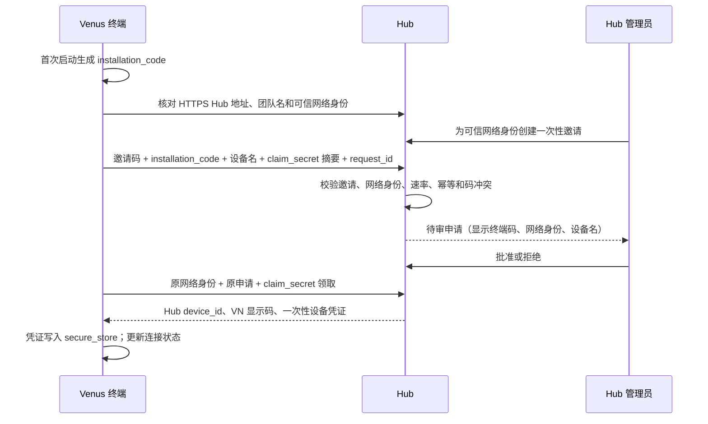
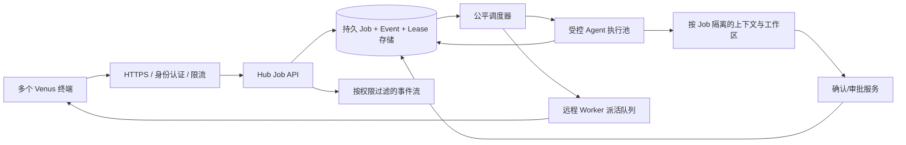

# Venus Hub：终端标识、多人异步任务与前端改造架构

> 版本：2026-09-28。本文基于当前代码实现提出下一轮工程改造，文中的「现状」「目标」「验收」必须分开理解。

## 1. 决策摘要

**每一份 Venus 终端安装都可以在首次启动时生成一个专属、稳定、可复制的本机标识码。**但这个码只用于辨认「是哪台终端」，不能凭码自动获得任意 Hub 的成员身份、项目权限或 Worker 执行权。连接指定 Hub 仍需知道 Hub 地址、通过可信网络身份校验、提交加入申请、由 Hub 管理员审批，并领取绑定此 Hub 的设备凭证。加入某个项目还需项目邀请或负责人授权。

当前代码还没有「安装即生成本机码」：`team_enrollment.py` 在 Hub 初始化或审批加入申请时才分配 `VN-....-....` 显示码；`project_hub_view.py` 在未注册设备时提示码不可用。下一轮应增加一个安装时生成的本机码，同时保留现有 Hub 分配的显示码。界面明确显示二者用途，避免用户把公开标识当密钥。

多人任务方面，当前 `agent_jobs.py` 是内存 `deque` + 单 Worker，`llm_server.py` 使用全局 `_agent_lock`；多个用户可以提交任务并拿到 Job ID，但 Agent 实际串行执行，且进程重启后已落盘的排队任务不会自动恢复。目标是先建立可靠、公平的持久队列和任务隔离，再在确认共享状态已拆分后增加安全并发，不能直接把 Worker 数量调大并删除全局锁。

## 2. 术语与身份模型

| 对象 | 建议格式及作用域 | 谁生成、何时生成 | 是否秘密 | 能授予什么 |
| --- | --- | --- | --- | --- |
| 本机安装标识 `installation_code` | `VI-` 加 128 位随机量的 Base32 可读码；作用域为本机安装实例 | Venus 首次启动本地生成，持续保存 | 否 | 仅供人辨认和核对申请来源 |
| Hub 设备 ID `device_id` | Hub 内部 ID；作用域为单一 Hub | Hub 批准设备时生成 | 否 | 单独不能授权 |
| Hub 终端显示码 `display_code` | 现有 `VN-XXXX-XXXX`；作用域为单一 Hub | Hub 批准设备时生成 | 否 | 用于项目邀请时定位已入队设备；单独不能授权 |
| 申请领取密钥 `claim_secret` | 至少 256 位随机量；单次申请 | 终端申请时本地生成 | 是 | 仅在相同可信网络身份、已审批申请上领取一次设备凭证 |
| Hub 设备凭证 `device_token` | Hub 专属高熵令牌 | Hub 在成功领取时生成 | 是 | 与可信网络身份及服务端设备状态共同认证；不代表项目权限 |
| 项目认领码/邀请码 | 一次性、限时、限对象 | Hub 为特定动作生成 | 是 | 仅在服务端核验全部条件后完成指定动作 |
| Worker 本机授权 | 项目和终端的能力配置 | 终端拥有者在本机开启 | 否，但受设备凭证保护 | 允许该终端按授权范围领取 Worker 任务 |

本机码与 Hub 码不可互换。一个人有多台电脑时，每台电脑有不同本机码；同一台电脑连接多个 Hub 时，本机码保持相同，各 Hub 的 `device_id`、显示码和设备凭证各自独立。安装目录被复制到其他电脑时应检测/提示重复身份并提供「重置本机标识」，重置后须重新申请设备，不能沿用旧凭证。卸载重装且未保留用户数据时产生新本机码。

### 2.1 本机码的生成与保存

- 使用 `secrets.token_bytes(16)` 生成 128 位随机量，并编码成不易混淆的 Base32 字符串；生成代码应只运行一次，不能在每次启动时重建。
- 将本机码作为公开标识单独保存到 Venus 的用户数据目录，采用临时文件加原子替换写入。设备凭证继续放在 `secure_store`，不得混入公开标识文件、日志、剪贴板、分享文案。
- 本机码不携带姓名、邮箱、机器名、路径或硬件指纹；不需要读取设备硬件 ID。
- Hub 端在同一 Hub 内为活跃/待领取申请建立唯一索引；同一个码重复申请不同设备时给出冲突提示并要求人工核对。不能因为码相同就合并账号。
- 本机码是稳定的展示码，不提供「输入别人的码直接接管设备」API；如未来需要更强的设备证明，可增加本地私钥与 Hub 保存公钥，并对挑战值签名。

### 2.2 入 Hub 流程

保留现有「管理员邀请 → 申请 → 审批 → 领取」主流程。`installation_code` 作为额外的申请核对字段，不代替现有 `claim_secret`、Tailscale 身份或审批。服务端公开申请对象只返回码，不返回密钥摘要。审批时必须再次检查申请者网络身份、邀请状态及码冲突；领取时检查原申请绑定的本机码与领取请求一致。管理员撤销设备后项目权限立即失效；申请人再次入队走新申请。

「人人可生成本机码」的边界是：人人可以在自己终端上生成，但只有能访问指定 Hub 的可信网络成员才能发起该 Hub 的申请；只有管理员批准后才拿到该 Hub 的设备凭证。不同 Hub 的成员和项目数据互不共享。

## 3. 前端体验改造

### 3.1 导航与信息层级

目前「团队与成员」页负责连接和入队，「项目中心」又重复展示 Hub 地址与终端码；`project_hub_view.py` 将连接、项目、认领、邀请、成员授权与 Worker 操作放在同一长滚动页。目标是在现有 Tk 界面上改成清楚的四层，不要求重写整个桌面端：

1. **连接卡片**：Hub 名称/地址、可信网络身份、本机码、Hub 显示码、设备状态。未连接时主操作是「连接 Hub」；待审批时是「查看申请状态」；已连接时是「进入项目中心」。复制码旁有「公开标识，不能代替邀请码/密钥」说明。
2. **我的项目列表**：项目名、本人角色、项目状态、未读审批数、正在运行任务数；支持「全部/我负责/待处理」过滤；归档项目单独标记。点击后打开项目详情。
3. **项目详情**：任务、审批、成员与设备、设置四个可见分区；按钮按角色和项目状态启用/禁用并解释原因。创建项目、认领项目、接受邀请作为向导/弹层，而不是常驻多段表单。
4. **任务中心**：区分「我发起」「待我审批」「项目任务」；每个任务显示发起人、项目、排队/运行/待确认/完成状态、事件时间、取消权限；进入详情才能看完整事件和结果。

第一轮实施可保留现有窗口架构，先重排「连接」和「我的项目」区域、加入明确状态展示与任务入口；不要为视觉重构改变授权接口。复杂治理操作可继续打开现有独立窗口。

### 3.2 连接向导状态机

| 状态 | 应展示的信息 | 主操作 | 禁止的操作 |
| --- | --- | --- | --- |
| `local_only` | 本机码、尚未连接 | 输入/核对 Hub 地址 | 项目邀请、Worker 领取 |
| `hub_verified` | Hub 地址、团队名、可信网络身份 | 输入一次性邀请并申请 | 把本机码视为认证 |
| `pending` | 申请号、本机码、提交时间 | 刷新/查看申请状态 | 重复申请、领取凭证 |
| `approved` | 审批结果 | 领取设备凭证 | 未领取即访问项目 |
| `active` | Hub 显示码、用户/设备身份、项目列表 | 进入项目中心 | 显示设备令牌明文 |
| `rejected/revoked/expired` | 明确原因和后续动作 | 重新申请或联系管理员 | 静默重试旧凭证 |

本机码在尚未连接时即可看到和复制；Hub 显示码仅 `active` 后出现。所有网络请求在后台线程执行，UI 主线程只消费结果并更新控件；按钮请求中禁用，关闭窗口后停止更新已销毁控件。请求失败时保留用户输入，展示可恢复动作。若 Hub 地址变化，先核对来源，绝不向新地址附带旧设备凭证。

### 3.3 多人任务 UI 数据契约

任务列表最少需要：`job_id`、项目、发起人、可见性、状态、`created_at`、排队位次/预计等待范围（若服务端能提供）、`started_at`、`finished_at`、最近事件序号、本人可执行动作。界面区分「排队中」「执行中」「等待团队审批」「已完成」「失败」「已取消」，并能从审批请求直达所属 Job。任务详情使用 SSE 事件流；断线后以最后事件 ID 续接，必要时轮询补齐。不要用前端本地倒计时推测执行完成；以后端状态为准。

## 4. 多人异步处理架构

### 4.1 当前问题与目标

目前 Job JSON 已写入 `.venus/jobs/`，但待执行 ID 只在内存队列中；重启时队列没有重建。单 Worker 串行调用 `_execute_agent_job`，后者又持有全局 `_agent_lock`。此外，`llm_server.py` 中 `_current_agent_task_id`、`_pending_git_snapshot`、`_agent_modified_files` 等状态是进程级变量，直接放开并发会让不同用户的确认、文件改动记录或快照串线。

目标行为：用户 A 和 B 同时提交时立即拿到各自 Job ID；调度器公平选取待执行任务；独立项目/隔离工作区上的任务可以在受控并发额度内运行；同一个可写工作区的任务保持互斥；等待审批的任务不无期限占用执行槽；重启后状态可以恢复或明确失败；所有读取、审批、取消、Worker 派活都按身份和项目重新校验。

### 4.2 逻辑组件

**MVP 存储建议：**若仍是单进程 Hub，可先在当前 JSON 存储上实现启动扫描、原子状态迁移和去重，但必须明确只允许一个 Hub 进程。若要多进程部署或可靠租约，迁移到 SQLite WAL，表至少包括 `jobs`、`job_events`、`job_leases`、`idempotency_keys`、`approval_requests`；所有状态迁移用事务和条件更新。不能让多个进程同时操作现有内存锁/JSON 索引，以免重复派活。部署文档要把单进程限制写清楚，直到 SQLite 租约验收完成。

现有 `worker_hub.py` 已把远程 Worker 调用与投票写在 `worker_calls.db` 的 SQLite WAL 中，并通过目标终端主动轮询领取一次性租约；这种 `worker_task` 虽然也有一个状态为 `queued` 的 Job 外壳，却**不得**被 Agent 执行队列恢复扫描选中。Worker 离线时任务保留到有效期，租约过期按现有一次性执行语义结束，不能自动重派可能已产生副作用的操作。Agent Job 与 Worker call 跨两个存储，状态同步需要保持可重试的对账逻辑。

### 4.3 Job 数据与状态

每个 Job 固定 `job_id / hub_id / project_id / owner_user_id / owner_device_id / visibility / workspace_key / resource_class / request_id / created_at / updated_at / status / attempt / lease_owner / lease_until / generation`。`workspace_key` 是经服务端归一化后的项目工作区身份，不接受客户端任意路径直接作为锁键。`request_id` 在同一用户、项目、动作范围内幂等，重复提交返回原 Job。

状态允许：`queued → leased → running → waiting_confirm → running → completed|failed|cancelled`，及 `queued/leased/running/waiting_confirm → cancelled`。对外可兼容现有 `queued/running/waiting_confirm/...`，内部另存租约状态。每次状态变更和事件递增 `event_seq`，记录操作者、时间与原因。终态不可回到运行态；重试需新 attempt/generation，外部副作用只可在可验证的幂等键下重试。

### 4.4 公平调度与并发额度

调度维度以 `(project_id, owner_user_id)` 建队列，同优先级采用轮转/按上次派活时间选择，防止一个用户一次提交大量任务长期压住别人。建议初始上限：全局 Agent 并发 2、每个项目 Agent 并发 1、每个用户 Agent 并发 1、每个 `workspace_key` 可写任务并发 1；这些是配置参数，默认值需依据隔离审计逐步放开。Worker 派活与 Agent 执行分别计量，不共用一个全局锁。排队超过上限返回明确 `429/队列已满`，不要无限制写盘。

调度循环选择下一任务时按顺序执行：加载候选 → 重新核验成员和设备权限 → 检查项目状态及额度 → 对工作区申请互斥租约 → 原子领取 Job 并分配 `generation` → 执行。若权限已撤销，任务应终止并记录原因，不继续消费旧授权。工具调用和审批放行前也须再次核验当下权限。

等待审批不应阻塞其他人的调度：Job 转为 `waiting_confirm` 后释放计算并发槽，但保留本次工作区变更的明确隔离/冻结语义；审批通过后重新排队抢占资源，并校验工作区版本与批准内容未变。若当前 Agent 循环无法安全暂停/续跑，第一阶段可以让审批中的运行占据该工作区槽，但仍要使其他项目的调度继续；文档和 UI 明确这一限制。绝不能在 Agent 线程仍可能执行工具时提前释放工作区锁。

### 4.5 并发隔离整改清单

在把 Agent 并发从 1 提升到 2 前，Luna 必须逐项审计并改造：

1. `_current_agent_task_id` 改为按 `task_id` 跟踪的运行注册表；确认请求的归属直接查 `task_id → Job`，不再比较单个全局任务 ID。
2. `_pending_git_snapshot` 与 `_agent_modified_files` 改为 Job 本地上下文或 `contextvars` 加线程传递；任何清空/回滚不能影响另一任务。共享工作区的真实写操作继续按 `workspace_key` 串行。
3. 确认表以 `request_id + task_id + project_id + owner` 绑定；待审列表和回应在每次请求重新校验项目成员、设备和策略版本。等待确认、取消、超时、任务结束的清理仅删除本 Job 条目。
4. 会话写入、记忆提交、计划状态、工具调用链、取消 Event 逐项检查是否全局可变；共享数据加事务/锁，任务局部数据放入 `JobContext`。
5. 同一项目的 Git 变更与远程 Worker 副作用有各自的资源锁和幂等键。不同项目并行必须使用不同工作区根目录；工具侧从服务器绑定上下文取路径，不能信客户端提交的任意路径。
6. 旧的同步 SSE Agent 路径与异步 Job 路径需要共享同一容量控制器，避免同步路径绕过额度。迁移期间可让同步路径保持保守串行，但不能与后台 Job 在同一工作区并行写入。

若上述审计任一点不能证明隔离，先交付「可靠公平的串行执行」并标注并发门仍为 1；不能声称已实现多人并行。

### 4.6 恢复、取消和事件流

- **重启恢复**：启动扫描 `queued`；未过期 `lease` 等待续租/回收；过期的 `running` 标记 `interrupted`/失败或在无副作用且幂等的步骤重试。不能无条件重跑含文件/命令副作用的 Agent。
- **租约心跳**：运行者定期延长 `lease_until`；每次状态写入检查 `generation`（fencing token），旧运行者即使苏醒也不能覆盖新结果。
- **取消**：排队任务原子转 `cancelled`；运行任务先置取消请求并发信号，等待线程实际退出后释放工作区锁；取消者权限按发起人或项目 owner/admin 判断。
- **事件流**：事件持久化且有单调 `event_seq`；SSE 带 `id:`，接收 `Last-Event-ID` 后补发未读事件。每次连接及持续推送都重新检查 Job 可见性。私有 Job 仅本人可见，团队 Job 仅当前项目成员可见。取消/踢人后应断开已有流。
- **审批**：审批对象关联 Job、项目、具体工具/变更版本、候选审批者和截止时间；重复投票幂等；一票否决/票数达标按项目策略生效。项目成员被移除或策略版本变化时旧票失效。
- **限流**：按用户/项目限制未结束 Job 数、单任务时长、事件大小及请求速率；管理面板展示实际运行数和等待数。

## 5. 建议接口增量

尽量兼容现有 `/api/v1/team/*`、`/api/v1/projects/*`、`/api/v1/jobs/*`：

| 接口/字段 | 修改建议 |
| --- | --- |
| `POST /api/v1/team/join-requests` | 加可选 `installation_code`；校验格式、把它与申请及设备绑定；旧客户端仍可申请以便平滑迁移 |
| `GET /api/v1/team/join-requests/{id}` | 返回当前申请的本机码及审批状态，不返回任何密钥或哈希 |
| 管理员申请列表 | 展示本机码、设备名、Tailscale 身份；显著提示须核对实际申请人 |
| `POST .../claim` | 新客户端带本机码，服务端核对与原申请一致；旧申请兼容但审计标记 `legacy` |
| `GET /api/v1/team/me` | 继续返回该 Hub 的终端显示码和设备状态；不要返回设备令牌 |
| `GET /api/v1/jobs` | 增加服务端过滤 `scope/project/status/cursor` 和排队元数据；过滤先于分页，避免别人的任务占掉列表额度 |
| `GET /api/v1/jobs/{id}/events` | 支持 `Last-Event-ID` 与稳定事件 ID；重连补发且持续鉴权 |
| `POST /api/v1/jobs` | 对同一用户/项目的 `request_id` 幂等；返回 Job 与可见排队信息 |

本机码不是必填凭证字段，任何 API 不可因为码匹配就跳过设备令牌和项目授权。项目邀请仍只接受 Hub 已登记的 `VN` 显示码，并检查项目权限、邀请目标身份与有效期。

## 6. 工程落地顺序与验收

### 阶段 A：终端标识与前端

1. 增加本机标识模块，保证并发首次启动只生成一个码、原子落盘、重启稳定。
2. 扩展现有加入申请与管理员审批展示，服务端绑定码；旧客户端兼容。
3. 前端连接卡片及状态机：安装后未入队也能复制本机码；入队后同时显示「本机码」和「此 Hub 的终端码」。将高频任务入口提前，压缩长页中的低频表单。
4. 契约测试覆盖：首次生成/重启稳定、两台终端不同码、重复码冲突、申请/领取码不一致被拒、旧申请兼容、码本身不能访问项目。

### 阶段 B：可靠队列与公平性

1. 启动恢复磁盘中的 `queued`，排队取消不会复活，重复入队不会重复执行；处理索引与单 Job 文件写入中断。
2. 增加以项目和用户为维度的公平选取、未结束任务限额、`request_id` 幂等、可观测的排队信息。
3. 保留并发 1 的安全门直到共享状态隔离通过；部署仍设单 Hub 进程。
4. 测试 A 连续提交多单、B 后提交一单时 B 不会一直排在 A 后；重启后 queued 恢复；取消后不执行；两次相同请求只产生一单。

### 阶段 C：受控并行与异步审批

1. 完成第 4.5 节的进程级共享状态整改，建立 `JobContext` 与工作区锁；测试两个不同项目并行、同工作区互斥。
2. 将审批等待拆成持久的任务状态，重连/重启能看到待审记录；审批后再次验证权限和工作区版本。
3. SSE 增加稳定事件 ID 和续传；断开/撤权时正确停止可见事件。
4. 在 Linux 单机环境用至少两个真实终端账号验证：同时提交、互相不可见私有任务、同项目审批、取消、Hub 重启恢复、Worker 离线重连。此验收完成前不宣称生产级并行。

## 7. 本轮 Luna 实施边界

本轮可并行拆两条工程线：

- **前端线**：本机码生成/展示、连接状态表达、项目中心信息层级和任务入口，复用已有 API 客户端与线程回调模式。不要改动权限服务端逻辑；新增字段可先做向后兼容。
- **服务端线**：申请绑定本机码、排队恢复与公平调度、任务隔离审计，并完成能安全验证的并发改造。若无法在本轮证明并发安全，交付并发门 1 的可靠队列及明确的未完成项，避免产生跨用户串线。

两条线都需运行相关契约测试，并报告实际实现的阶段、通过的测试、仍受限制的场景。

## 8. 本轮实际落地与边界（2026-09-28）

### 已实现

- Venus 本地首次使用时生成 128 位随机的 `VI-` 本机码，原子保存，同一数据目录的并发进程复用；在尚未加入 Hub 时即可展示和复制。Windows 文件锁等待设超时，避免一直卡住界面。
- 申请与领取携带同一个本机码；Hub 校验格式、活跃码冲突和领取时与原申请的一致性。管理员可在申请列表核对。旧客户端申请保持兼容；旧 Hub 没有明确回传绑定证明时，前端显示「未确认绑定」。本机码本身不能通过 Hub 认证。
- 项目中心首屏前置连接身份、项目概况/筛选和任务/审批入口；Agent 任务与 Worker 派活分别标识。任务入口跳转成功会关闭项目中心窗口和轮询。
- Agent 队列启动时恢复已落盘的 `queued`；`running`、`waiting_confirm` 在重启后以安全失败结束，不自动重跑有副作用的工具。已取消任务不会复活，重复入队不会重复执行；远程 `worker_task` 创建时即写入类型标记，恢复扫描不会误派给 Agent。
- 调度按项目与用户轮转，按 Hub/用户/项目限制未结束任务量，同一用户与项目的 `request_id` 提供幂等。定时任务按本地日期构造触发键，保留次日继续运行的语义。
- Job 事件增加单调序号和 `Last-Event-ID` 续传；超过最近 100 条的保留窗时发送 `resync`，客户端应重新读取 Job 快照。

### 仍待实现或验证

- **Agent 同时执行仍为 1。** 当前进程级 Agent 状态和文件/确认状态尚未全部转成任务隔离上下文。公平排队允许多人异步提交与查看进度，但不能把它描述为不同用户的 Agent 已安全并行。第 4.5 节是后续解除并发门的具体清单。
- 队列现在按单 Hub 进程运行；多进程租约、数据库事务、跨进程 fencing、审批暂停后释放执行槽与完整事件历史尚未落地。
- 本轮完成了项目中心首屏重排，详细的项目详情分区/任务中心统一视图仍按第 3 节继续建设。
- 已通过定向自动化测试与编译检查；尚未在真实 Linux Hub、两个实际 Venus 终端及实际 Tk 界面上完成端到端/视觉联调。

### 已运行的定向验证

`agent_jobs_test.py` 29/29，`team_enrollment_contract_test.py` 54/54，`cancel_confirm_test.py` 14/14；远程 Worker、本机码、前端、Hub 客户端、项目归档和治理合同测试均通过；相关文件 `py_compile` 与 `git diff --check` 通过。
