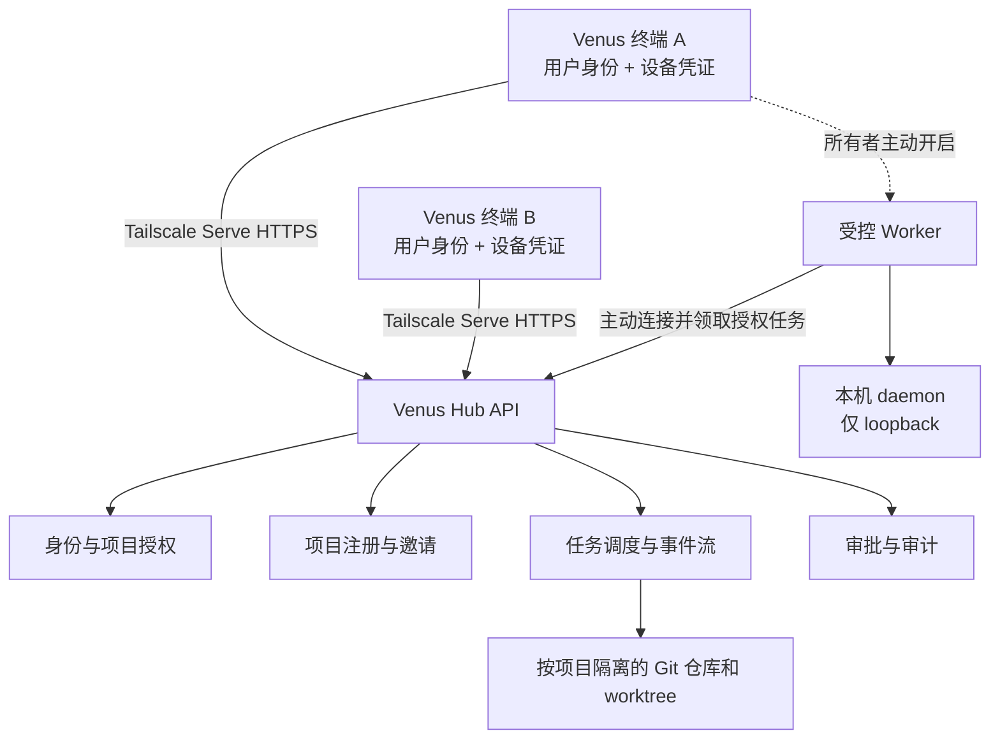

# Venus 多项目 Hub：产品架构与实施任务提示词

> 本文可整体复制给开发 Agent。目标是把现有单团队 Hub 升级为可在服务器上管理多个独立项目的 Venus 项目中心，并让不同 Venus 终端按项目加入、工作和审批。默认部署为服务器 Hub 加 Windows Venus 终端；具体服务器操作系统在实施时核对。

## 任务总述

你是 Venus 仓库的产品架构师与实施工程师。请在 `D:\私人agent` 当前工作树上完成多项目 Hub 的设计和落地。先检查现有代码、文档、测试和未提交改动，保留用户已有修改。给出简短的差距评估后继续实施，不停留在概念方案。

这次改造的产品目标是：一个服务器 Hub 可以创建多个独立项目；每个项目有自己的负责人、成员、Venus 终端、任务和审批；终端加入某项目后，只能看到和操作被授权的项目资源。终端是否接受来自项目的本机执行任务，是另一项需要终端所有者主动开启的授权。

现有基线需要重点核对：

- `src/team_enrollment.py` 目前负责单 Hub、单团队的邀请、审核与设备凭证。
- `src/project_store.py` 已记录 `owner_id` 和 `is_team`，但活跃项目保存在全局文件。
- `src/llm_server.py` 的 `_can_access_project` 当前对团队项目直接放行；项目列表、任务、SSE、确认和变更接口都需要项目级权限。
- `src/team_versions.py` 已提供每项目独立 Git 仓库、任务 worktree、SHA 审阅、合并和回退，应复用而非重写。
- `src/agent_jobs.py` 已有后台 Job 状态与事件流。
- `src/venuschat_v1/` 已有团队连接、成员与设备、任务卡片和变更审阅界面，需要扩展为多项目体验。
- 当前团队 Hub 使用 `--isolated --team-serve`，通过 Tailscale Serve HTTPS 接入；保留这一边界。

## 一、产品概念与关键决策

### 1. Hub、项目、用户和终端的关系

Hub 是服务器上的组织入口，负责身份验证、项目注册、任务调度、审批、审计和数据存储。一个 Hub 可有多个项目。用户是自然人身份，一名用户可属于多个项目；一名用户可使用多台 Venus 终端。一台终端也可加入多个项目，但各项目的授权独立。

项目是权限和数据隔离的基本单位。每个项目拥有独立的 `project_id`、负责人、成员关系、终端授权、任务、Git 仓库、worktree、变更单、审批策略和审计视图。Hub 级管理员负责服务器运行、备份和异常恢复；这一身份不应自动赋予所有项目的日常业务权限。服务器操作系统管理员仍有基础设施层面的访问能力，产品界面不能宣称对此具有物理隔离。

Venus 终端有两个身份：

1. **访问终端：**用户通过它查看项目、发起任务和审批。加入项目只授予项目内的应用权限。
2. **执行 Worker：**终端所有者额外开启后，才可为指定项目提供受限的文件、命令或桌面操作。成为项目成员不会自动启用 Worker。

### 2. 四种“码”必须各司其职

| 名称 | 谁生成与持有 | 用途 | 安全属性 |
| --- | --- | --- | --- |
| 项目认领密钥 | Hub 生成，仅向创建者显示一次 | 创建者在已认证的私人终端认领负责人权限 | 高强度随机、绑定创建者与项目、短时有效、限次尝试、用后即废 |
| 终端显示码 | 终端注册后由 Hub 分配 | 负责人在邀请界面找到具体 Venus 终端 | 可展示的设备标识；知道它不能登录或加入项目 |
| 项目邀请码 | 项目 owner/admin 创建 | 邀请指定用户与终端加入指定项目 | 一次性、限时、可撤销，绑定项目、用户、设备与预期角色 |
| 设备凭证 | Hub 在已批准设备领取时签发 | 终端每次请求证明自己的设备身份 | 单设备保存、服务端仅保存校验材料、可轮换与撤销 |

请不要把项目认领密钥做成永久管理员密码，也不要把终端显示码当成访问令牌。Windows 终端沿用 DPAPI 保存设备凭证；服务器端不记录明文认领密钥或邀请码。所有密钥通过加密连接传输，不放在 URL、Git、任务正文或日志中。

### 3. 项目创建和首次认领

1. 已通过 Hub 身份验证的用户发起创建，填写项目名称、简介、可选共享范围。未认证请求不能占用项目名称或创建项目。
2. Hub 建立 `pending_claim` 项目，记录 `creator_user_id`，生成至少 128 bit 随机性的认领密钥，格式适合复制和人工核对。密钥只显示一次，服务端保存摘要和过期时间，默认有效 15 分钟、最多 5 次失败尝试。
3. 创建者在自己的已认证 Venus 终端输入密钥。Hub 同时检查 Hub 身份、设备状态、项目创建者、项目状态、密钥、有效期和尝试次数。成功后，原子地把项目转为 `active`，授予创建者唯一的初始 `owner` 身份，并给当前终端加入该项目的设备授权。密钥立即失效。
4. 未认领且过期的项目可由原创建者重新生成认领密钥，旧密钥即刻失效；长期无人认领的项目可清理或归档。认领后的 owner 恢复不依赖旧密钥，而应走所有权转移或受审计的服务器恢复流程。
5. 若创建动作本身发生在同一 Venus 终端，仍保留输入密钥的产品流程，但文档应说明这一步主要用于项目与终端的明确绑定，不能被表述为独立的第二认证因素。

### 4. 终端注册、邀请与加入

1. 用户先通过现有 Hub 连接和身份验证流程注册 Venus 终端。注册后的终端获得稳定 `terminal_id` 和人类可读的显示码，例如 `VN-7C4M-2Q9P`；显示码须校验唯一性，可以重置显示值但不能改变底层设备身份。
2. 项目 owner/admin 输入显示码，并指定预期用户身份、角色和有效期。Hub 返回可核对的终端名称与用户信息，创建项目邀请。管理员看到的是邀请状态，不获取受邀终端的设备凭证。
3. 终端收到邀请后，用户在本机看到 Hub 地址、项目名称与 `project_id`、负责人、拟授予角色及共享资源范围，并主动接受。Hub 再检查用户身份、终端凭证、邀请绑定信息和有效期，原子地创建用户的项目成员关系与该终端的项目授权。
4. 同一用户用第二台终端访问已加入项目时，第二台终端须另行获得项目授权。移除一台终端不改变该用户在其他已批准终端上的权限。
5. 重复接受、邀请码误输、邀请撤销、设备停用、用户不匹配、项目不匹配和重定向到其他 Hub 均有明确错误状态，不向错误 Hub 发送本机凭证。

### 5. 角色与权限矩阵

建议初版使用以下角色，所有操作仍以 `project_id`、`user_id`、`terminal_id` 和对象状态作具体判断：

| 操作 | Owner | Admin | Member | Viewer |
| --- | --- | --- | --- | --- |
| 查看项目、任务和获准共享文件 | 是 | 是 | 是 | 是 |
| 发起任务、提交变更 | 是 | 是 | 是 | 否 |
| 对他人的变更投票 | 符合审批资格时 | 符合审批资格时 | 符合审批资格时 | 否 |
| 邀请或移除普通成员、撤销项目终端授权 | 是 | 是 | 否 | 否 |
| 设置管理员、修改审批策略、转移所有权 | 是，按敏感操作规则 | 只能提出申请 | 否 | 否 |
| 归档项目、恢复归档项目 | 是，按敏感操作规则 | 否 | 否 | 否 |

一个项目始终至少有一名有效 owner。初版可固定唯一 owner，所有权转移需要目标成员主动接受，转移完成后原 owner 变为 admin；不能通过移除成员或撤销设备造成无 owner 状态。Hub 级 `admin` 与项目级 `admin` 要分别命名和校验，避免全局角色误用。

### 6. 项目工作与审批体验

成员进入项目后看到项目概览、任务、成员和终端、待审批、代码变更与审计。派发团队任务时必须绑定当前项目。Job 继承项目范围、发起人和执行目标；Hub 按项目隔离查询、SSE 事件、取消和确认待办。个人会话、个人记忆和本机私人文件不随项目加入而共享。

“同时审批”在产品上定义为多名合格成员分别投票，达到项目配置的票数后才合并或执行；投票可以异步进行，界面实时显示 `已通过/所需票数`、审批人、到期时间和变更摘要。代码变更默认至少有一名**非作者**审阅人。高风险操作可配置至少两名不同自然人参与，其中至少一人不是发起者。票数不足时保持待审批，不自动降低阈值。

每次审批请求保存创建时的策略快照，并绑定 `project_id`、`change_id`、准确的提交 SHA、作者、文件列表或工具参数摘要。作者不能给自己的代码变更投票；重复投票不重复计数。追加提交、刷新基线、变更文件、审批人离开项目或项目策略发生相关变化时，旧票按规则失效。拒绝、超时和取消均阻断执行，并留下审计记录。

项目 owner/admin 可立即移除失去信任的普通成员或撤销终端，撤销应立即生效并记录原因。此动作不能使等待中的审批自动达标；被移除者的有效票要重新计算或失效。管理员提权、降低审批阈值和所有权转移须经过更严格的项目级审批。项目只有一名成员时，应允许 owner 完成初次邀请等启动操作，但不能把需要其他人审阅的代码合并伪装为多人批准。

## 二、产品架构

### 1. Hub 服务层

- **Identity 层：**保留 Hub 用户与设备的认证，增加项目成员和项目终端授权。每个 API 请求先验证 Hub 身份，再验证目标项目和目标对象；默认拒绝未明确授权的访问。Tailscale 提供传输和可验证的用户身份线索，项目权限由 Venus 自己决定。
- **Project Registry：**创建、认领、归档项目；维护项目 owner、简介、状态、配额和策略版本。
- **Enrollment：**管理终端显示码、项目邀请、成员接受、设备授权与撤销。Hub 入队和项目入队是两个步骤。
- **Jobs：**沿用现有异步 Job 与 SSE，增加项目成员与设备授权检查、目标 Worker 和权限快照。
- **Review：**复用 `team_versions.py` 的 Git 审阅，按项目计算合格审批人；每票绑定变更 SHA。
- **Audit：**记录 actor、device、project、action、object、result、request_id、timestamp。审计查询也按项目授权过滤；密钥和私人正文不进入日志。

### 2. 数据与存储

推荐为新的身份、成员、认领、邀请和审批元数据建立 SQLite 数据库，开启合适的事务和 schema 版本迁移；现有 Git 仓库和任务工作目录继续按项目存放。不要为实现新权限而一次性重写所有现有 JSON 任务和记忆存储。先写可回滚迁移，数据库操作与现有文件操作的跨存储步骤需要明确失败补偿和幂等键。

建议实体至少包括：

- `hub_users`：用户 ID、身份来源标识、状态。
- `hub_devices`：终端 ID、用户 ID、显示码、设备凭证摘要或公钥、状态、最后使用时间。
- `projects`：项目 ID、创建者、owner、状态、策略版本、创建与更新时间。
- `project_memberships`：项目 ID、用户 ID、角色、状态、授予人与时间；唯一键 `(project_id, user_id)`。
- `project_device_grants`：项目 ID、终端 ID、允许的访问能力与状态；唯一键 `(project_id, device_id)`。
- `project_claims`：认领密钥摘要、创建者、到期、失败次数、领取状态。
- `project_invites`：项目、预期用户、终端、角色、邀请码摘要、状态和到期时间。
- `approval_requests` 与 `approval_votes`：对象版本、策略快照、资格快照、投票人与结果。
- `worker_grants`：终端所有者主动授权的项目、工具类别、工作目录、有效期和状态；若本期接入 Remote Worker 才启用。

继续使用 `.venus/team_projects/<project_id>/repo/`、`worktrees/` 和 `changes/` 存放项目版本数据。凭据、邀请、私人会话、个人记忆、审计原文和设备秘密不进入项目 Git 仓库。项目目录仍需检查符号链接、路径穿越、文件类型、文件数量和大小上限。

### 3. 状态机

- 项目：`pending_claim → active → archived`，未认领超时可进入 `expired`。
- 认领密钥：`issued → claimed / expired / revoked`。
- 项目邀请：`issued → accepted / rejected / expired / revoked`。
- 成员：`active → removed`；再次加入创建新的可审计授予记录。
- 项目终端授权：`active → revoked`；终端离线不等于撤销。
- 审批请求：`pending → approved / rejected / expired / invalidated`；内容变化重新生成请求或版本。
- Worker：`disabled → available → busy/offline/revoked`；离线不能自动续跑有副作用的工具调用。

所有状态转换通过一个明确的服务层完成，写入审计，使用事务或幂等键防止重复点击和并发请求产生两名初始 owner、重复成员或重复执行。

### 4. Remote Worker 与本机控制边界

上一阶段需求包括“服务器管理团队任务，连接后可以在宿主机执行”。请把这一能力纳入架构，但不要让“加入项目”自动等于“远程控制”。初版 Worker 可作为独立里程碑实现：终端所有者在本机主动开启，选择可服务的项目、允许的工具、工作目录和时限；Hub 只向满足授权的在线 Worker 派发工具调用。Worker 主动通过已有 HTTPS 通道连接 Hub，本机 daemon 保持 loopback，不向服务器或局域网开放端口。

Hub 保持 `--isolated`，继续负责模型调用、团队 Job、审批与审计。Worker 只执行带 `project_id`、`job_id`、`worker_id`、`tool_call_id`、能力范围和过期时间的调用，并在本机再次校验。屏幕、键鼠和高风险命令须经宿主机所有者本机确认，并显示当前操作来源与紧急止停入口。Windows 桌面操作只能在已登录的交互用户会话中工作；无可用桌面时明确报错。Worker 生成的本机文件不能自动进入项目 Git；共享文件必须经明确选择和项目变更单审阅。

### 5. VenusChat 信息架构

新增或调整以下页面，不把所有控制项塞入现有“团队与成员”单页：

1. **Hub 连接：**Hub 地址、当前用户、设备状态、终端显示码和设备撤销。
2. **我的项目：**项目列表、角色、待审批数量、最近任务；当前项目按用户或终端保存，不再使用服务器全局活跃项目。
3. **创建项目：**名称、简介、创建成功后的一次性密钥展示及认领状态。
4. **项目设置：**成员、终端、邀请、审批策略、所有权转移、归档。
5. **项目工作区：**任务、进度、版本变更、diff、审批和项目审计。
6. **本机执行授权：**独立展示 Worker 开关、授权项目/目录/工具、正在执行的任务及停止按钮。

密钥展示窗口只显示一次；项目和终端显示码可以复制。邀请确认页要同时显示 Hub 身份、项目 ID、负责人、授权角色和终端名称，帮助用户在接受前检查目标。

### 6. 部署与运行

保留 Tailscale Serve HTTPS 与后端 loopback 绑定。现有 Windows 启动脚本保留；若目标服务器是 Linux，新增 systemd 或等效运行指南，包括 Tailscale Serve 配置、服务启动、开机恢复、健康检查、数据目录权限、备份、恢复与升级回退。当前非 Windows `secure_store` 使用权限受限文件并发出警告；在服务器部署前评估高价值长期凭据的存储方案，至少确保服务账号专用、文件权限、备份加密和凭据轮换，且服务端只持有认领码、邀请码与设备凭证的校验材料。

## 三、实施顺序

### 里程碑 A：身份与项目隔离

完成数据库 schema、迁移、项目创建/认领、项目成员关系、终端显示码、项目邀请和项目授权。把 `_can_access_project`、`_can_access_job`、项目列表、Job 详情/SSE/取消、确认待办及所有变更 API 改为对象级权限。把全局活跃项目改为用户或终端范围。此阶段应能演示两个项目互不越权。

### 里程碑 B：审批与项目管理界面

完成角色管理、踢人、撤销终端、所有权转移、项目审批策略、有效票重新计算和审计。完成 VenusChat 的项目中心、邀请接受、成员管理、审批列表和清晰的错误状态。复用现有 Git worktree、差异审阅、rebase 与回退。

### 里程碑 C：服务器部署与受控 Worker

完成目标服务器操作系统的部署和双终端联调；根据上述独立授权规则接入 Worker。这个里程碑结束时，加入项目的终端可以自愿提供受限执行能力，项目任务能选择该终端，宿主机所有者可本机确认并随时止停。

每个里程碑都要保持可运行、可测试，不能因为后续功能未完成而把前一阶段的权限边界放宽。

## 四、必须通过的验收场景

1. A 以认证身份创建项目 P1，取得一次性认领密钥；A 在自己的 Venus 终端输入后成为 P1 owner。B 拿到同一密钥仍无法认领；密钥重复使用、过期和错误尝试均被拒绝。
2. B 的终端显示码交给 A。A 为 P1 邀请 B 的指定身份和终端；B 核对项目并接受。只知道终端显示码的 C 无法加入。
3. C 创建 P2。A、B 不能因属于同一个 Hub 就读取 P2 的项目详情、任务、SSE、确认、diff 或审计；C 也不能读取 P1。
4. B 同时加入 P1 与 P2，并在另一台终端登录。撤销 B 在 P1 的终端授权后，P1 请求立即失败；B 在 P2 的授权保持有效。
5. A 提交 P1 代码变更，B 查看准确 SHA 与 diff 后投票。A 自审失败；变更更新或 rebase 后 B 的旧票失效。合并保留现有目标 HEAD 校验。
6. A 移除 B 后，B 对 P1 的任务、SSE 和变更接口立即失去访问；B 原有批准不再计数。项目审计仍保留身份、动作和时间。
7. 唯一 owner 不能被踢出或自行移除。所有权转移需要目标用户接受，并保持全过程可审计。
8. Worker 未开启时，项目成员不能控制任何终端屏幕或本机文件。开启后，只有被授权项目、目录和工具可用；屏幕操作要宿主机本机确认；离线、注销、撤销和止停均按拒绝处理。
9. Hub 与终端重启后，项目、成员、终端授权、任务和审批状态正确恢复。迁移前后现有个人任务、团队任务和 Git 审阅测试不回归。

自动测试至少覆盖：项目枚举与对象级越权、认领码暴力尝试与重放、邀请错绑、设备撤销、角色提权、审批资格变化、重复投票、并发认领、全局活跃项目串扰、跨项目文件路径、Worker 调用过期和重复执行。双终端真实联调需要保留可复现步骤；没有实际进行的联调不得标为通过。

## 五、最终交付格式

完成后请提供：

1. 产品流程图、服务架构图、数据模型、状态机和关键 API 合同。
2. 迁移脚本与 dry-run 结果；迁移前备份方式和回滚步骤。已有团队项目的 `owner_id` 可迁为项目 owner；其他成员的项目访问应由明确迁移规则或管理员选择决定，不能默认为全部可见。
3. 后端、VenusChat、部署脚本和文档的修改清单。
4. 实际运行的测试命令、通过或失败结果，以及可复现的双终端验收记录。
5. 尚未完成的功能、已知限制和下一步优先级。不要把设计稿、模拟响应或未执行的双机流程写成已交付能力。

## 设计依据

- 当前实现：[项目存储](../src/project_store.py)、[团队入队](../src/team_enrollment.py)、[团队审批](../src/team_collab.py)、[版本协作](../src/team_versions.py)、[现有协作方案](collaboration-plan.md)。
- 权限默认拒绝并逐请求检查：[OWASP Authorization Cheat Sheet](https://cheatsheetseries.owasp.org/cheatsheets/Authorization_Cheat_Sheet.html)。
- 密钥的生成、过期、轮换与撤销：[OWASP Secrets Management Cheat Sheet](https://cheatsheetseries.owasp.org/cheatsheets/Secrets_Management_Cheat_Sheet.html)。
- 服务器入口的 HTTPS 与身份头边界：[Tailscale Serve 文档](https://tailscale.com/docs/features/tailscale-serve)。
