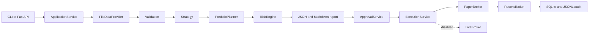

# Architecture

## Boundaries

The project is a standalone `src-layout` package. It reads only project-local config and fixture files and writes only project-local `var/` state. The parent workspace is not an import dependency.



## Data flow

`FileDataProvider` loads `MarketSnapshot` and `AccountSnapshot`. Validation creates explicit `ValidationIssue` objects. Valid snapshots are passed to the strategy; invalid snapshots create a blocked plan without attempting order generation.

The strategy emits only `StrategySignal` objects. `PortfolioPlanner` turns those signals into `TargetPosition` and `ProposedOrder` objects. It does not submit orders. `RiskEngine` receives the account, market, and candidate orders separately from the strategy and returns structured `RiskCheck` objects plus allowed/blocked order IDs.

`ApplicationService` creates a `DailyPlan`, computes its canonical `plan_hash`, persists a `DailyReport`, and writes both report formats. `ApprovalService` creates an immutable approval binding. `ExecutionService` re-loads current fixtures, re-runs validation and risk, verifies the approval binding, and only then calls `PaperBroker`.

## Persistence

SQLite stores reports, approvals, executions, key/value safety state, and audit events. A JSONL audit file mirrors append-only events for easy inspection. Fixture data, reports, and logs remain under `var/` and are ignored by Git.

No external service is required for the MVP. The database uses Python's built-in `sqlite3`; this avoids a dependency download while preserving a local transactional store.

## Determinism

Deterministic behavior is based on:

- fixed local fixtures;
- explicit `FrozenClock` in tests;
- normalized Decimal serialization;
- sorted collections in plan/order construction;
- stable order/client IDs derived from canonical order identity;
- stable PaperBroker fill policies.

The `NarrativeProvider` interface is intentionally replaceable. The MVP uses a deterministic template provider; no LLM or OpenAI API is called.

## State machine

Reports move through explicit transitions in `domain/state_machine.py`. Illegal transitions raise `StateTransitionError`. The primary execution path is:

```text
DRAFT -> GENERATED -> PENDING_APPROVAL
PENDING_APPROVAL -> APPROVED | PARTIALLY_APPROVED | REJECTED | EXPIRED
APPROVED/PARTIALLY_APPROVED -> EXECUTING
EXECUTING -> FILLED | PARTIALLY_FILLED | FAILED | CANCELLED
```

Risk-blocked reports terminate at `RISK_BLOCKED`; they cannot be approved.
