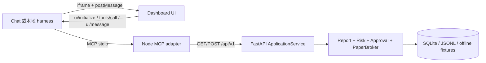

# MCP Apps GUI 架构

## 选择与入口

目标优先级是 React + TypeScript + Vite；本隔离环境没有现成的 React/Vite/Playwright 包，联网安装也不符合离线复现约束，因此选择无依赖的原生 Web Components 风格实现。它仍然使用模块化 JavaScript、语义 DOM、可测试的 bridge 合同和同一套 MCP Apps 协议；如果后续环境提供锁定的前端依赖，可以只替换 UI 构建层，不改变 MCP tool/resource 合同。

入口文件：

- UI source：[ui/src/index.html](../plugins/quant-agent-dashboard/ui/src/index.html)、`app.js`、`style.css`；
- 构建输出：`plugins/quant-agent-dashboard/ui/dist/index.html`；
- MCP stdio server：[mcp-server/src/index.mjs](../plugins/quant-agent-dashboard/mcp-server/src/index.mjs)；
- MCP tool/resource contract：`mcp-server/src/tools.mjs`、`protocol.mjs`；
- 本地宿主模拟：[harness/server.mjs](../plugins/quant-agent-dashboard/harness/server.mjs)。



## MCP Apps 合同

所有带 UI 的 tool definition 声明 `_meta.ui.resourceUri`：
`ui://quant-agent-dashboard/dashboard.html`。`resources/read` 返回
`text/html;profile=mcp-app`，UI 可脱离组件以 tool text/structured content 工作。

UI 首先发送 `ui/initialize`，消费宿主下发的
`ui/notifications/tool-input`、`ui/notifications/tool-result` 和主题 context，
使用共享 `tools/call` 请求工具，并用 `ui/message` 请求对话跟进。`window.openai`
只作为 feature-detected optional fallback；没有按宿主产品名称分支，也没有只实现
产品专用 API。

## 数据和状态

UI 的唯一事实源是 `quant_get_dashboard` 返回的后端投影。每个 side-effect tool 成功后立即重新调用 dashboard：

| UI 状态 | 后端真值 / 处理 |
|---|---|
| 首次加载、无报告 | loading skeleton；无报告显示生成入口和 N/A，不编造账户 |
| 风险阻断 / 过期 | 红/黄 banner，审批/执行按钮禁用 |
| 待审批 | 展示报告版本、计划哈希、订单集合、风险检查、到期时间 |
| 部分审批 | 仅精确订单 ID 进入 approval；执行仍由后端复核 |
| 已批准 | 显示二次“执行 Paper Trading”按钮；不自动执行 |
| Kill Switch | 常驻保护条、禁用执行、展示 actor/reason |
| 部分成交 / reconciliation | 显示 broker order、剩余订单和审计时间线 |
| MCP 断开、错误、版本冲突 | 状态面板 + 稳定错误 code + 重新连接，不清空安全提示 |

桌面用双栏策略/风险视图和可横向滚动订单表；移动到 320px 仍无页面级横向滚动。风险不只靠颜色，图表有文字摘要，重点按钮有文本和键盘 focus，减少动效，支持 light/dark。

## 本地命令

```powershell
cd quant-agent-lab\plugins\quant-agent-dashboard
node scripts\build.mjs
node --test mcp-server/tests/contract.test.mjs ui/tests/ui-contract.test.mjs standalone/tests/host-contract.test.mjs
node harness\e2e-demo.mjs
node harness\server.mjs
```

`harness/server.mjs` 默认使用项目专用后端端口 `8014`，若 `8000` 被其他服务占用不会连接它；可用 `?scenario=blocked|partial|kill-switch|error|expired|conflict&theme=dark` 做本地状态演示。
